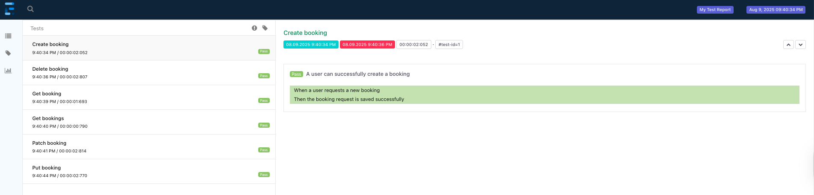

# API Automation Project – Restful Booker Endpoints

## 📌 Overview  
This project automates **API testing** of the [Restful Booker](https://restful-booker.herokuapp.com/) application using **Java** and **Cucumber BDD**.  
It covers **positive test scenarios** for the following HTTP methods:  
- **POST** (Create a booking)  
- **GET** (Retrieve booking(s))  
- **PUT** (Update booking)  
- **PATCH** (Partial update booking)  
- **DELETE** (Remove booking)  

---

## ✅ Features  
- **Positive Scenarios** automated:  
  1. Create a booking with valid data (**POST**)  
  2. Retrieve all bookings (**GET**)  
  3. Retrieve booking details by ID (**GET**)  
  4. Update a booking with valid data (**PUT**)  
  5. Partially update a booking (**PATCH**)  
  6. Delete a booking (**DELETE**) and verify it no longer exists  

---

## 🏗 Design Pattern  
- **Cucumber BDD** for more readable scenarios  
- **API Client classes** for request handling  
- **POJO classes** for mapping request/response payloads  
- **Context** for sharing data between steps  

---

## 🛠 Tech Stack  
- **Java**  
- **RestAssured**  
- **Cucumber**  
- **JUnit**  

---

## ▶️ Execution 🚀  
Tests can be executed via the **Runner** class.  

---

## 📊 Reporting
Each execution produces a new report under target with the name **ExtentReport.html.** When this file is opened in a browser a nicely structured report of the test results can be viewed.

